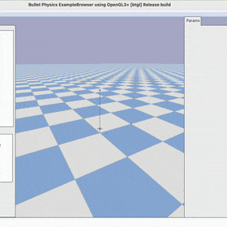

# DroneGym

This is a fork of the `gym-pybullet-drones` repository.

 

## Installation

Tested on Intel x64/Ubuntu 22.04 and Apple Silicon/macOS 14.1.

```sh
git clone https://github.com/utiasDSL/gym-pybullet-drones.git
cd gym-pybullet-drones/

conda create -n drones python=3.10
conda activate drones

pip3 install --upgrade pip
pip3 install -e . # if needed, `sudo apt install build-essential` to install `gcc` and build `pybullet`

```

## Use

### PID control examples

```sh
cd gym_pybullet_drones/examples/
python3 pid.py # position and velocity reference
python3 pid_velocity.py # desired velocity reference
```

### Downwash effect example

```sh
cd gym_pybullet_drones/examples/
python3 downwash.py
```

### Reinforcement learning examples (SB3's PPO)

```sh
cd gym_pybullet_drones/examples/
PYTHONPATH="/Users/connoranthow/dev/p_dev/DroneGym" python3 learn.py --cvagent True
python learn.py --multiagent true # task: 2-drone hover at z == 1.2 and 0.7
```

 

### utiasDSL `pycffirmware` Python Bindings example (multiplatform, single-drone)

Install [`pycffirmware`](https://github.com/utiasDSL/pycffirmware?tab=readme-ov-file#installation) for Ubuntu, macOS, or Windows

```sh
cd gym_pybullet_drones/examples/
python3 cff-dsl.py
```

### Betaflight SITL example (Ubuntu only)

```sh
git clone https://github.com/betaflight/betaflight # use the `master` branch at the time of writing (future release 4.5)
cd betaflight/ 
make arm_sdk_install # if needed, `apt install curl``
make TARGET=SITL # comment out line: https://github.com/betaflight/betaflight/blob/master/src/main/main.c#L52
cp ~/gym-pybullet-drones/gym_pybullet_drones/assets/eeprom.bin ~/betaflight/ # assuming both gym-pybullet-drones/ and betaflight/ were cloned in ~/
betaflight/obj/main/betaflight_SITL.elf
```

In another terminal, run the example

```sh
conda activate drones
cd gym_pybullet_drones/examples/
python3 beta.py --num_drones 1 # check the steps in the file's docstrings to use multiple drones
```

## Core Team WIP

- [ ] Multi-drone `crazyflie-firmware` SITL support (@spencerteetaert, @JacopoPan)
- [ ] Use SITL services with steppable simulation (@JacopoPan)

## Desired Contributions/PRs

- [ ] Add motor delay, advanced ESC modeling by implementing a buffer in `BaseAviary._dynamics()`
- [ ] Replace `rpy` with quaternions (and `ang_vel` with body rates) by editing `BaseAviary._updateAndStoreKinematicInformation()`, `BaseAviary._getDroneStateVector()`, and the `.computeObs()` methods of relevant subclasses

## Troubleshooting

- On Ubuntu, with an NVIDIA card, if you receive a "Failed to create and OpenGL context" message, launch `nvidia-settings` and under "PRIME Profiles" select "NVIDIA (Performance Mode)", reboot and try again.

Run all tests from the top folder with

```sh
pytest tests/
```
